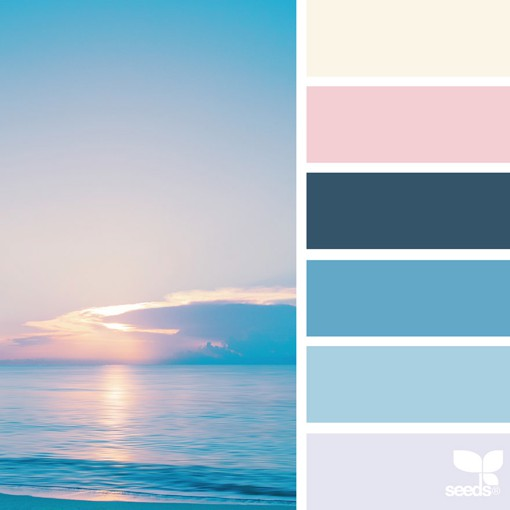

# WebProject
專題！！！大家加油！！！
 
## About our project
1A2B 的網頁小遊戲

## Some resources
<a href="https://hackmd.io/@x10/HJl1rdgMo" targen="_blank">HTML & CSS</a> (之前寫的講義，可以參考)

## 配色參考

color1 rgb(250,245,232)

color2 rgb(237,208,211)

color3 rgb(59,83,103)

color4 rgb(115,166,196)

color5 rgb(177,207,223)

color6 rgb(229,229,240)

蝦蝦到此一遊
123
瑢 簽
簽到